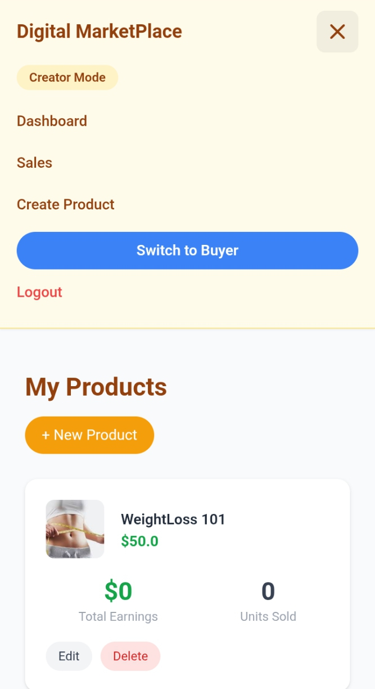
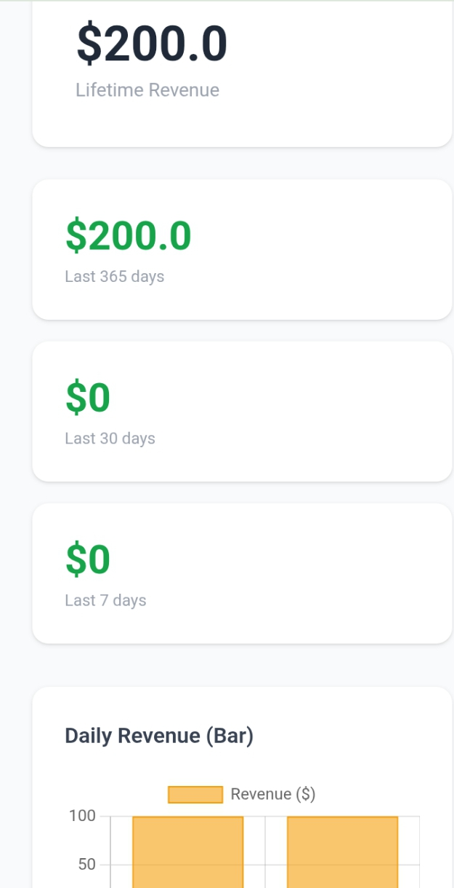

# Digital Marketplace

A full-stack digital product marketplace built with Django — where creators can upload and sell digital products (courses, eBooks, files) and buyers can purchase, download, and rate them.

---

## Demo / Screenshots

**Live demo:** https://digitalm-0doy.onrender.com


> 📸 Add your screenshots or GIF demo here

<!-- Replace the lines below with your actual image paths or URLs -->

**Homepage / Product Listings**


**Product Detail Page**


**Seller Dashboard**


**Sales Analytics**


> 💡 Tip: Create a `screenshots/` folder in your repo root, add your images there, and the links above will work automatically.

---

## Features

- **User Authentication** — Register, login, and logout with Django's built-in auth system
- **Dual Mode** — Switch between Buyer Mode and Creator Mode within the same account
- **Product Management** — Creators can create, edit, and delete digital product listings with thumbnails
- **Product Search** — Search products by name or description from the homepage
- **Stripe Payments** — Secure checkout via Stripe with order tracking and payment confirmation
- **Purchase-Gated Downloads** — Only buyers with a verified paid order can download a product file
- **Seller Dashboard** — Creators see all their products with units sold and total earnings
- **Sales Analytics** — Revenue breakdown by day, week, month, and year with Chart.js visualizations
- **Star Ratings** — Verified buyers can rate products (1–5 stars); one rating per buyer per product
- **Cloudinary Media Storage** — Product thumbnails and files stored persistently on Cloudinary
- **Responsive Design** — Mobile-friendly UI built with Tailwind CSS

---

## Technologies Used

| Layer | Technology |
|---|---|
| Backend | Python 3, Django |
| Database | SQLite (development) |
| Payments | Stripe Checkout API |
| Media Storage | Cloudinary |
| Frontend | Django Templates, Tailwind CSS, Chart.js |
| Deployment | Render (Gunicorn + WhiteNoise) |
| Auth | Django built-in authentication |

---

## Installation & Setup

### Prerequisites
- Python 3.10+
- pip
- Git

### Steps

**1. Clone the repository**
```bash
git clone https://github.com/your-username/digital-marketplace.git
cd digital-marketplace
```

**2. Create and activate a virtual environment**
```bash
python -m venv venv

# On Mac/Linux
source venv/bin/activate

# On Windows
venv\Scripts\activate
```

**3. Install dependencies**
```bash
pip install -r requirements.txt
```

**4. Create your `.env` file**

Copy the example below into a new file called `.env` in the project root and fill in your values (see [Environment Variables](#environment-variables) section):
```bash
cp .env.example .env
```

**5. Run database migrations**
```bash
python manage.py migrate
```

**6. Create a superuser (optional — for admin panel access)**
```bash
python manage.py createsuperuser
```

**7. Start the development server**
```bash
python manage.py runserver
```

Visit `http://127.0.0.1:8000` in your browser.

---

## Environment Variables

This project uses a `.env` file for sensitive credentials. **Never commit this file to GitHub.**

Create a `.env` file in the project root with the following variables:

```env
# Django
SECRET_KEY=your-django-secret-key
DEBUG=True

# Stripe
STRIPE_SECRET_KEY=sk_test_your_stripe_secret_key
STRIPE_PUBLISHABLE_KEY=pk_test_your_stripe_publishable_key

# Cloudinary
CLOUDINARY_CLOUD_NAME=your_cloudinary_cloud_name
CLOUDINARY_API_KEY=your_cloudinary_api_key
CLOUDINARY_API_SECRET=your_cloudinary_api_secret
```

### Where to get each value

| Variable | Where to get it |
|---|---|
| `SECRET_KEY` | Generate one at [djecrety.ir](https://djecrety.ir) or run `python -c "from django.core.management.utils import get_random_secret_key; print(get_random_secret_key())"` |
| `STRIPE_SECRET_KEY` / `STRIPE_PUBLISHABLE_KEY` | [Stripe Dashboard](https://dashboard.stripe.com) → Developers → API Keys |
| `CLOUDINARY_CLOUD_NAME` / `CLOUDINARY_API_KEY` / `CLOUDINARY_API_SECRET` | [Cloudinary Dashboard](https://cloudinary.com) → Home (shown on first screen after login) |

> ⚠️ For production (e.g. Render), set `DEBUG=False` and add these same variables in your hosting platform's environment settings.

---

## How to Use

### As a Buyer
1. **Register** an account at `/register/`
2. **Browse products** on the homepage — use the search bar to filter by name or description
3. **Click a product** to view its detail page
4. **Purchase** using your card via Stripe Checkout (use Stripe test card `4242 4242 4242 4242` in development)
5. After payment, go to **My Purchases** to download your file and leave a star rating

### As a Creator (Seller)
1. Log in and click **Switch to Creator** in the navigation bar
2. Go to **Dashboard** to see all your listed products
3. Click **Create Product** to upload a new digital product (name, description, price, file, thumbnail)
4. Click **Edit** on any product to update it, or **Delete** to remove it
5. Go to **Sales** to see your revenue breakdown across different time periods

### Admin Panel
- Visit `/admin/` and log in with your superuser credentials to manage all users, products, and orders directly

---

## Deployment

This project is deployed on **Render**. Key production setup:

- `DEBUG=False` in environment variables
- Gunicorn as the WSGI server (`gunicorn mysite.wsgi`)
- WhiteNoise for static file serving
- Cloudinary for all media file storage (required since Render's filesystem is ephemeral)
- All `.env` variables added manually in Render's Environment tab

---

## License

This project is open source and available under the [MIT License](LICENSE).
